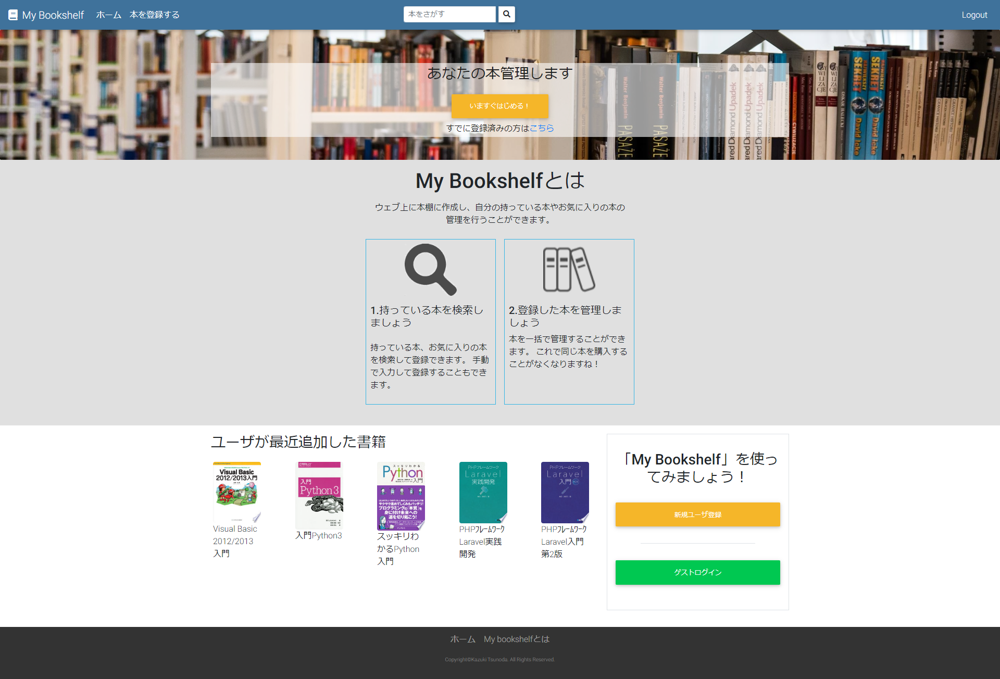
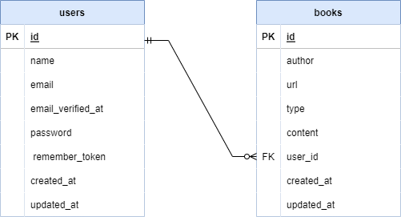

# 書籍管理ツール「My-bookshelf」

## アプリケーション概要
web本棚サービスです。
自分の持っている本、購入したい本を登録することができます。
サイト内で本を検索し登録することができます。

## URL
[https://rocky-shelf-10901.herokuapp.com/](https://rocky-shelf-10901.herokuapp.com/)

## 目指した課題解決
小説や漫画などを書店で購入する際どこまで購入したかわからなくなり、
同じ巻数を購入したり、１巻飛びで購入してしまうことを解決したい、と思いアプリケーションを作成しました。

## 使用技術
### フロントエンド
* HTML
* CSS,Sass
* Bootstrap 4.3.1

### バックエンド
* PHP 8.1
* Laravel 8.83.19
* MySQL 8.0.26
* composer

### インフラ
* Nginx 1.21.1
* Docker 20.10.4/Docker-compose 1.29.2

### その他
* Git2.36.1/GitHub
* PHPMyAdmin
* VSCode

## アプリの機能一覧
### メイン機能
* 書籍登録（CRUD処理）
* 書籍検索（Google Books API)

### 認証機能
* ユーザ登録・ログイン・ログアウト
* ゲストログイン

## 実装予定の機能
* おすすめ機能
* 本棚内検索機能
* お気に入り機能

## ER図

